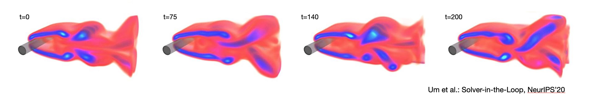
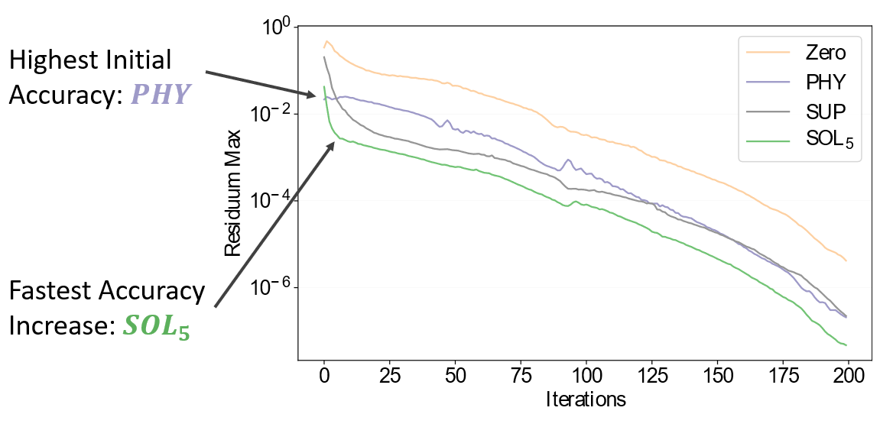
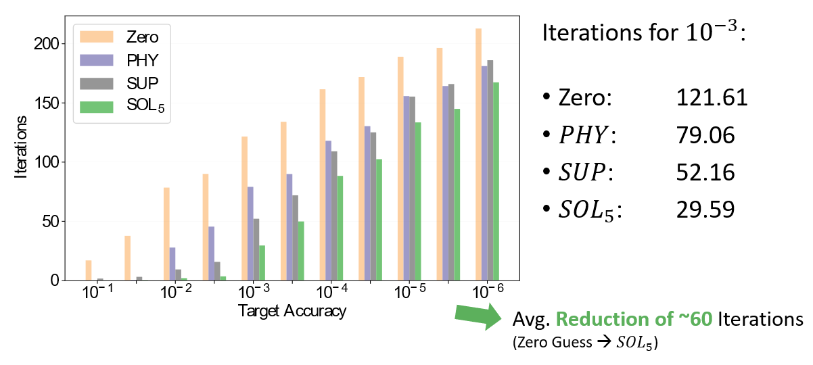
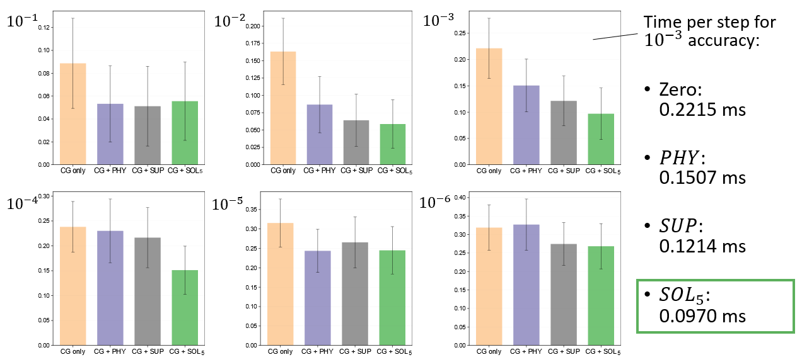
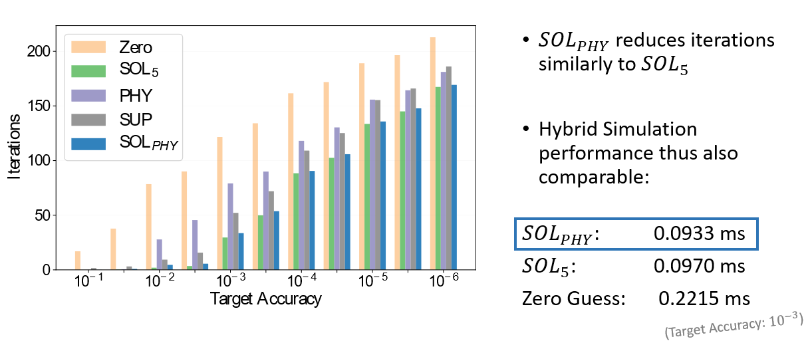
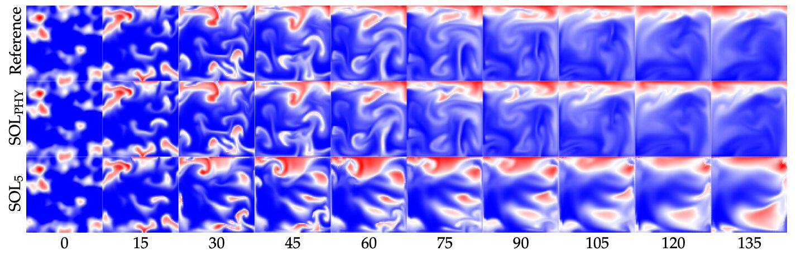

# Solver-Based Learning of Pressure Fields for Eulerian Fluid Simulation

## Overview

This is the source code repository for the _CG-Solver_ component (written by Robert Brand) of the NeurIPS'20 paper "Solver-in-the-Loop: Learning from Differentiable Physics to Interact with Iterative PDE-Solvers" (authors Kiwon Um, Robert Brand, Raymond (Yun) Fei, Philipp Holl, and Nils Thuerey; <http://arxiv.org/abs/2007.00016>).

The goal of this component is to train a Convolutional Neural Network (CNN) in combination with a differentiable iterative solver for linear systems of equations, such that it learns to produce initial guesses that are suitable for quick error reductions in the iterative solver. In addition to the versions presented in our paper, we include an improved variant below that combines a divergence residual with the solver-in-the-loop training. This *SOL-phy* version is explained in more detail in section 6.4.3 (p44) of [Robert's thesis](https://ge.in.tum.de/download/2020-solver-in-the-loop/CG-solver-in-the-loop.pdf)
 
The full Solver-in-the-Loop code, containing code for training in conjunction with other PDE-solvers (such as Navier-Stokes) can be found at: <https://github.com/tum-pbs/Solver-in-the-Loop> , and here's the main [project page](https://ge.in.tum.de/publications/2020-um-solver-in-the-loop/).



# Results

we investigate the interaction of learning models with conjugate gradient (CG) solvers. We target Poisson problems, which often arise many PDEs, e.g., in electrostatics or in fluid flow problems where the pressure gradient is subtracted from a divergent flow to compute a divergence-free motion. Specifically, we explore the iteration behavior of the CG solver given an initial state predicted by a trained model.

We investigate different approaches to training a CNN so that it can infer a pressure solution that can be used as an initial guess for a Conjugate Gradient (CG) solver in a Eulerian Poisson solver, e.g. for the pressure correction step of a fluid simulation.

In particular, we compare three different loss formulations and use a slightly different notation from the main paper:
1. *SUP*: A standard supervised loss (previously denoted by NON in the main paper)
2. *PHY*: An unsupervised, physics-informed loss (directly minimizing the residual divergence after correcting with the pressure guess)
3. *SOL*: A loss including the differentiable CG solver which minimizes the difference of the network's prediction to a limited-iteration CG solution computed on top of the network's guess
4. *SOL-phy*

This repository contains the source code used to generate the data, train the models and analyze their performance.
It also includes a snapshot of Φ<sub>*Flow*</sub> (<https://github.com/tum-pbs/PhiFlow>) that was used for these experiments.

## Test Dataset Performance
Comparing the three approaches on sample divergence fields from our test dataset, we observed that the physics-based loss leads to a higher accuracy of the network's prediction itself, yet performs much worse as an initial guess for the CG solver than the solver-based approach in particular.



Given an initial guess by the model trained with the solver-based loss, the CG solver's residual divergence decreases very quickly over the first few iterations. This leads to the solver needing much fewer iterations to reach target accuracies like 10^-3 than it would from a zero guess or that of the physics-informed model.



## Simulation Performance
We evaluated the pressure predictors' in-simulation performance when used to fully replace the CG solver (Network simulation) and when used as an in conjunction with the CG solver to provide an initial guess (hybrid simulation).

### Network Simulation
The Physics-based model proved much more stable than either of the others, which was expected as its output has the highest standalone accuracy (as shown on the test dataset). However, the solver-based model showed much more unstable behaviour than anticipated. This instability can be traced to a checkerboard pattern that our solver-based approach introduces into its prediction. These artifacts lead to accumulating residual error as the network makes consecutive predicitons. 

We suspect this pattern to be the result of training the network with a direct difference to a CG-solver iteration with limited iterations. In the initial training steps, the network's guess is similar to a zero guess. Therefore, minimizing its difference to a CG solution computed by performing e.g. 5 iterations on top of it makes the network emulate the checkerboard patterns these intermediate CG solutions often contain.

### Hybrid Simulation
Using the trained models together with the CG solver, the solver-based approach fares much better. As on the test dataset, it is the most effective approach at reducing the iterations the solver needs to reach its target accuracy. This leads to tangible simulation speed-ups. Using a hybrid simulation scheme and our SOL model, simulation steps with an accuracy target of 10^-3 require less than half the computation time compared to a standard simulation step with zero guess.



## Combining Solver-Based and Physics-Informed Training

To leverage both the stability advantage we observed for the physics-informed model and the reduction in solver iterations provided by the solver-based training approach, we combined them into a fourth loss formulation. This approach no longer contains a direct difference of the network's output to an intermediate solver solution. Instead, it uses the output plus 5 additional differentiable solver iterations to correct the input divergence. The combined loss then minimizes the residual divergence of that correction.

We found that this effectively eliminated the checkerboard pattern and stability issues our previous solver-based approach showed, while maintaining the iteration reduction it enabled. The combined loss formulation can therefore be used to train models that function well as standalone pressure solvers and as providers of an initial pressure guess for the CG solver.



The following image shows several frames of an example simulation comparing the SOL-5 and SOL-phy models with a reference simulation:



# How to run the code

## Data Generation
To generate a dataset of randomized simulations, navigate to /nn and run:
```
python datagen_v3.py NUMBER_OF_SIMULATIONS
```
Replace NUMBER_OF_SIMULATIONS by the number of simulations you want, e.g. 3000.

## Training
To run one of the training scripts, navigate to /nn and run:
```
python TRAINING_SCRIPT NUMBER_OF_OPTIMIZATION_STEPS
```
For TRAINING_SCRIPT, insert one of the following:
- SUP: ```nn_supervised_v3.py```
- SOL: ```nn_unet3_v3.py``` (adjust the step width k inside the script)
- PHY: ```nn_tompson_scalar_v3.py```
- SOL-PHY: ```nn_combi_v3.py ```

Substitute NUMBER_OF_OPTIMIZATION_STEPS by a number, such as e.g. 300000, to determine how many training steps should be performed.
Also make sure the DATAPATH variable inside the script points to your dataset that should be used for training and validation.
By default, the scripts expect the dataset to comprise 3000 simulations, but you can easily adjust this in each script.

## Running Simulations
To use the trained models in a simulation where they act as a standalone pressure solver, run:
```
python nn_simulation_v3
```
Open the PhiFlow web interface, input the path to your checkpoint and press "Load Model". After this, you can run the simulation and see how your model performs.

For a hybrid simulation (where the model predicts an initial pressure guess and the CG solver iterates upon it until it reaches the target accuracy), run:
```
python nn_simulation_hybrid.py
```
And follow the same steps as for the network simulation.

# Conclusions

The SOL-phy model is able to cope with the divergence resulting from its own pressure corrections significantly better than the other versions, leading to a residual divergence that only slowly increases and even stagnates. This is even more interesting considering that, although it does not have the same checkerboard artifacts as SOL-5, there is a noticeable striped pattern in SOL-phy’s residual divergence. It appears that using the physics-baseed error metric for the final comparison instead of a direct difference between network output and solver output makes the trained network more tolerant to erratic patterns in its input.

In summary, SOL-phy combines the advantages of PHY and SOL-5 versions effectively. Due to observing the solver at training time, it retains the usefulness as an initial guess for the CG solver and thus achieves an almost identical speed-up as SOL-5 in a hybrid simulation. It also gains in simulation stability, as its error is ultimately determined by the actual physical residual.

Oveall our results demonstrate the usefulness of training neural networks in conjunction with the PDE environment in which they should later on be employed. Specifically, the results here demonstrate the importance of this training methodology for iterative solvers, and there is a large vareity of interesting developments to be made in order to obtain robust and efficient solvers that combine traditional numerical methods with trained neural networks.

If you find this repository useful, or have ideas for improvements we'd be happy to hear from you, e.g., at <i15ge@cs.tum.edu>!

You can cite our paper via:
```
@article{um2020sol,
  title="{Solver-in-the-Loop: Learning from Differentiable Physics to Interact with Iterative PDE-Solvers}",
  author={Um, Kiwon Brand, Robert and and Fei, Yun and Holl, Philipp and Thuerey, Nils},
  journal={Advances in Neural Information Processing Systems},
  year={2020}
}
```
